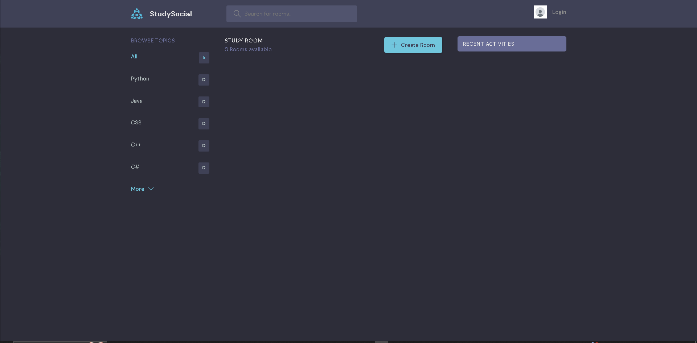
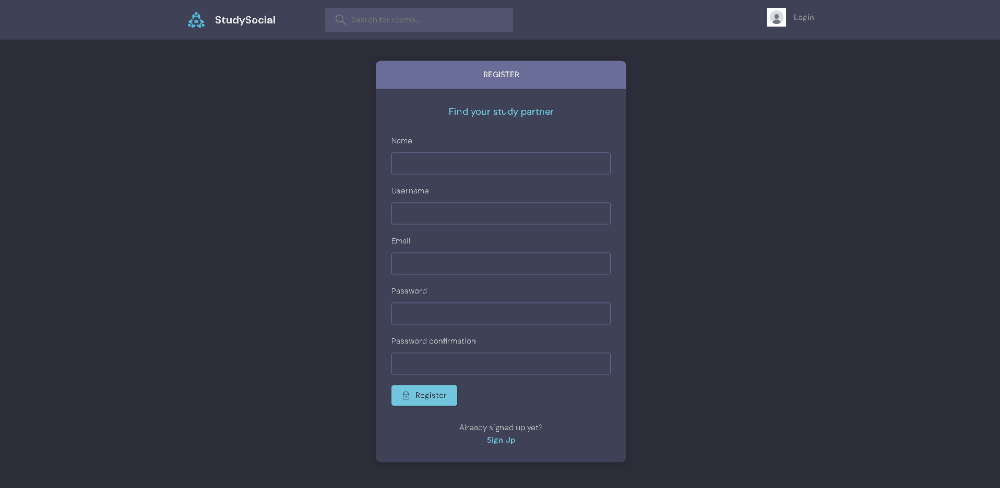

# Study-Social



Study-Social is a full stack website built using Django, Python, HTML, CSS and JavaScript.

This project was created as my fourth milestone project for my Level 5 Diploma in Web Application Development with the Code Institute.

[Visit Study-Social Here](https://study-social-8e0c28744b94.herokuapp.com/)

---

## Contents

* [User Experience](#user-experience)
  * [Strategy Plane](#strategy-plane)
    * [Project Goals](#project-goals)
  * [Scope Plane](#scope-plane)
    * [Feature Planning](#feature-planning)
  * [Structure Plane](#structure-plane)
    * [User Stories](#user-stories)
    * [Database Schema](#database-schema)
  * [Skeleton Plane](#skeleton-plane)
    * [Wireframes](#wireframes)
  * [Surface Plane](#surface-plane)
    * [Colour Scheme](#colour-scheme)
    * [Typography](#typography)
    * [Imagery](#imagery)
    * [Base Mockup](#base-mockup)
* [Features](#features)
  * [General Features of The Site](#general-features-of-of-the-site)
  * [Future Implementations](#future-implementations)
  * [Accessibility](#accessibility)
* [Technologies Used](#technologies-used)
  * [Languages Used](#languages-used)
  * [Database Used](#database-used)
  * [Frameworks Used](#frameworks-used)
  * [Libraries & Packages Used](#libraries--packages-used)
  * [Programs Used](#programs-used)
  * [Stripe](#stripe)
* [Deployment & Local Development](#deployment--local-development)
  * [Deployment](#deployment)
  * [### Migrating to Railway.app for deployment](#migrating-to-railwayapp-for-deployment)
  * [Local Development](#local-development)
    * [How to Fork](#how-to-fork)
    * [How to Clone](#how-to-clone)
* [Testing](#testing)
* [Credits](#credits)
  * [Code Used](#code-used)
  * [Content](#content)
  * [Media](#media)
  * [Acknowledgments](#acknowledgments)

---

## User Experience

### Strategy Plane

#### **Project Goals**

Study-Social is a Blog Site.

The sites primary audience will be people who have a love of Coding. Who like to learn different coding languages.


### Scope Plane

#### **Feature Planning**


User roles are included in this project as there are different features of the site dependant on what type of user you are. There are two categories of user for the site, Site User (who have signed up) and Admins (users who have superuser status and are able to perform additional tasks on the site, such as adding new posts.) Admins are also able to use their accounts in the same way a user would, such as write , create , delete, update, read posts.


### Structure Plane

#### **User Stories**

| User Story ID | As a/an | I want to be able to ... | So that I can... |
| :--- | :--- | :--- | :---|
| **VIEWING & NAVIGATION** |
| 1 | Site-User | view a paginated list of posts | easily select a post to view |
| 2 | Site-User | view a list of posts | I can select one to read |
| 3 | Site-User /Admin | view comments on an individual post | I can read the conversation |
| 4 | Site-User | view activities |  I can view my activity and other activities in my room  |
| **REGISTRATION & USER ACCOUNTS** |
| 5 | Site-User | register an account | I can comment and read the posts |
| 6 | Site-User | update my profile |  I can add a new picture and bio |
| 7 | Site-User | Log in and out | Keep my account information secure |
| **SEARCHING** |
| 8 | Site-User | search topics |  I can find interested topics |
| **Room & Topics** |
| 9 | Site-User | edit my room |  I can update description, name and topic |
| 10 | Site-User | create new room topics | i can have unique rooms |
| 11 | Site-User | create a room |  I have a own room for conversation |
| 12 | Site-User | click on a post |  I can read the full text |
| 13 | Site-User |  leave comments on a post |  I can be involved in the conversation |
| 14 | Site-User | create, read, update and delete posts | I can manage my blog content |
| **ADMIN** |
| 15 | Admin | edit a user |  I can update profile information |
| 16 | Admin | delete user |  I can hold my Site clear and safe |


#### **Colour Scheme**

Colors were used : aquamarine, #71c6dd, #e1f6fb, #3f415, #51546e, #696d97, #e5e5e5, #8b8b8b, #b2bdbd, #2d2d39, #5dd693, #fc4b0b, var(--color-light-gray)
var(--color-bg), var(--color-main), var(--color-dark), var(--color-light), var(--color-dark-medium), var(--color-gray), 

#### **Typography**

All fonts were sourced from [Google Fonts](https://fonts.google.com/).


#### **Imagery**

I use a default avatar picture from google.


## Features

### General Features of of the site

* Favicon - I used [Favicon.io](https://favicon.io/)

* Navbar - The navbar on the site is split into two sections, the first section contains the search bar, an account icon and the bag icon. The second section contains the Profile Settings. 


#### **Home Page**
In the home page you can see Browse Topics and Recent Activities section.


#### **Room Page**
In the room page you can see a Message field where you can write comments and also Participants joined section.


#### **Edit Room Page**

In the Edit Room Page you see different options to edit your room.


#### **Settings Profile Page**
In the profile settings you can update your profile.


#### **Profile Page**

This profil page include a edit profile button , about section and actuall post writing also a recect activities section.


#### **Browse Topics Page**

The Browse Topics Page gives user a search field where the user can search for topics , and see all topics.

#### **Admin Page for managing the site**

The admin page for Study-Social is only accessible for superusers. The admin page is where superusers can create, edit and delete rooms. Create, update and delete Users as well.


#### **Signup Page**

The signup page asks the user to enter their email address twice (to prevent any input errors) select a username for their account, and then input their password twice (again to check for input errors). The user is also given an button to Register for an account. Once the user clicks the Register button, they will be shown



#### Sign in Page

The sign in page provides inputs for a user to enter their email together with their password, a sign up button, a log in button.


### Future Implementations

In future implementations I would like to:

* Allow user to restore the password.
* Get an email verification.
* Confirm logout page.

### Accessibility

I have been mindful during coding to ensure that the website is as accessible friendly as possible. This has been have achieved by:

* Using semantic HTML.
* Providing information for screen readers where there are icons used and no text.
* Ensuring that there is a sufficient colour contrast throughout the site. (update on colours chosen explained in the colour scheme section.)

Accessibility was tested using Lighthouse.


---

## Technologies Used

### Languages Used

HTML, CSS, JavaScript, Python

### Database Used

sqlite3 for development.

[ElephantSQL](https://www.elephantsql.com/) for deployment.

### Frameworks Used

[Django](https://www.djangoproject.com/) - Version 3.2.16 - A high-level Python web framework that encourages rapid development and clean, pragmatic design.


### Libraries & Packages Used


[gunicorn](https://pypi.org/project/gunicorn/) - a Python WSGI HTTP Server

[pillow](https://pypi.org/project/Pillow/) - Python imaging library

[dj_databsae_url](https://pypi.org/project/dj-database-url/) - allows us to utilise the DATABASE_URL variable

[psycopg2](https://pypi.org/project/psycopg2/) - a postgres database adapter which allow us to connect with a postgres database


### Programs Used


[Git](https://git-scm.com/) - For version control.

[GitHub](https://github.com/) - To save and store the files for this project.

[Google Dev Tools](https://developer.chrome.com/docs/devtools/) - To troubleshoot, test features and solve issues with responsiveness and styling.

[Pip](https://pypi.org/project/pip/) - A tool for installing Python packages.

---

## Deployment & Local Development

### Deployment

The project is deployed using Heroku. To deploy the project:

#### **Create the Live Database**

We have been using the sqlite3 database in development, however this is only available for use in development so we will need to create a new external database which can be accessed by Heroku.

1. Go to the [ElephantSQL](https://www.elephantsql.com/) dashboard and click the create new instance button on the top right.
2. Name the plan (your project name is a good choice), select tiny turtle plan (this is the free plan) and choose the region that is closest to you then click the review button.
3. Check the details are all correct and then click create instance in the bottom right.
4. Go to the dashboard and select the database just created.
5. Copy the URL (you can click the clipboard icon to copy)

#### **Heroku app setup**

  1. From the [Heroku dashboard](https://dashboard.heroku.com/), click the new button in the top right corner and select create new app.
  2. Give your app a name (this must be unique), select the region that is closest to you and then click the create app button bottom left.
  3. Open the settings tab and create a new config var of `DATABASE_URL` and paste the database URL you copied from elephantSQL into the value (the value should not have quotation marks around it).

#### **Preparation for deployment in GitPod**

1. Install dj_database_url and psycopg2 (they are both needed for connecting to the external database you've just set up):

   ```bash
   pip3 install dj_database_url==0.5.0 psycopg2
   ```

2. Update your requirements.txt file with the packages just installed:

    ```bash
    pip3 freeze > requirements.txt
    ```

3. In settings.py underneath import os, add `import dj_database_url`

4. Find the section for DATABASES and comment out the code. Add the following code below the commented out database block, and use the URL copied from elephantSQL for the value:

    (NOTE! don't delete the original section, as this is a temporary step whilst we connect the external database. Make sure you don't push this value to GitHub - this value should not be saved to GitHub, it will be added to the Heroku config vars in a later step, this is temporary to allow us to migrate our models to the external database)

    ```python
    DATABASES = {
        'default': dj_database_url.parse('paste-elephantsql-db-url-here')
    }
    ```

5. In the terminal, run the show migrations command to confirm connection to the external database:

    ```bash
    python3 manage.py runserver
    ```

6. If you have connected the database correctly you will see a list of migrations that are unchecked. You can now run migrations to migrate the models to the new database:

    ```bash
    python3 manage.py migrate
    ```

7. Create a superuser for the new database. Input a username, email and password when directed.

    ```bash
    python3 manage.py createsuperuser
    ```

8. You should now be able to go to the browser tab on the left of the page in elephantsql, click the table queries button and see the user you've just created by selecting the auth_user table.

9. Install gunicorn which will act as our webserver and freeze this to the requirements.txt file:

    ```bash
    pip3 install gunicorn
    pip3 freeze > requirements.txt
    ```

10. Create a `Procfile` in the root directory. This tells Heroku to create a web dyno which runs gunicorn and serves our django app. Add the following to the file (making sure not to leave any blank lines underneath):

    ```Procfile
    web: gunicorn study.wsgi:application
    ```

11. Log into the Heroku CLI in the terminal and then run the following command to disable collectstatic. This command tells Heroku not to collect static files when we deploy:

    ```bash
    heroku config:set DISABLE_COLLECTSTATIC=1 --app heroku-app-name-here
    ```

12. We will also need to add the Heroku app and localhost (which will allow GitPod to still work) to ALLOWED_HOSTS = [] in settings.py:

    ```python
    ALLOWED_HOSTS = ['{heroku deployed site URL here}', 'localhost' ]
    ```

13. Save, add, commit and push the changes to GitHub. You can then also initialize the Heroku git remote in the terminal and push to Heroku with:

    ```bash
    heroku git:remote -a {app name here}
    git push heroku master
    ```

14. You should now be able to see the deployed site (without any static files as we haven't set these up yet).

15. To enable automatic deploys on Heroku, go to the deploy tab and click the connect to GitHub button in the deployment method section. Search for the projects repository and then click connect. Click enable automatic deploys at the bottom of the page.

#### **Generate a SECRET KEY & Updating Debug**

1. Django automatically sets a secret key when you create your project, however we shouldn't use this default key in our deployed version, as it leaves our site vulnerable. We can use a random key generator to create a new SECRET_KEY which we can then add to our Heroku config vars which will then keep the key protected.
2. [Django Secret Key Generator](https://miniwebtool.com/django-secret-key-generator/) is an example of a site we could use to create our secret key. Create a new key and copy the value.
3. In Heroku settings create a new config var with a key of `SECRET_KEY`. The value will be the secret key we just created. Click add.
4. In settings.py we can now update the `SECRET_KEY` variable, asking it to get the secret key from the environment, or use an empty string in development:

    ```python
    SECRET_KEY = os.environ.get('SECRET_KEY', ' ')
    ```

5. We can now adjust the `DEBUG` variable to only set DEBUG as true if in development:

    ```python
    DEBUG = 'DEVELOPMENT' in os.environ
    ```

6. Save, add, commit and push these changes.

### Local Development

#### **How to Fork**

To fork the repository:

1. Log in (or sign up) to GitHub.

2. Go to the repository for this project, https://github.com/JohannHelbert/Study-Social.

3. Click on the fork button in the top right of the page.

#### **How to Clone**

To clone the repository:

1. Log in (or sign up) to GitHub.

2. Go to the repository for this project, https://github.com/JohannHelbert/Study-Social.

3. Click the Code button, select whether you would like to clone with HTTPS, SSH or the GitHub CLI and copy the link given.

4. Open the terminal in your chosen IDE and change the current working directory to the location you would like to use for the cloned repository.

5. Type the following command into the terminal `git clone` followed by the link you copied in step 3.

6. Set up a virtual environment (this step is not required if you are using the Code Institute template and have opened the repository in GitPod as this will have been set up for you).

7. Install the packages from the requirements.txt file by running the following command in the terminal:

```bash
pip3 install -r requirements.txt
```

---

## Testing


---

## Credits

### Code Used

This project was created using methods taught in the Code Institutes walkthrough project for Boutique Ado.

The code to create the image zoom on the products page was taken from [Thdoan Magnify JS](https://thdoan.github.io/magnify/)

### Content

Content for the site was written by Kera Cudmore, save for product descriptions, which were adapted from the product descriptions on the Groves website.

### Media

* [Groves & Banks Ltd](https://www.grovesltd.co.uk/) - For allowing me [permission](documentation/readme/groves-permission.png) to use any of the images of their products from their website.

* [Noimage](https://www.canva.com/search/templates?q=lighthouse) - Created for free on Canva, utilising their design elements (Elegant minimalistic logo with lighthouse for seafood cafe) in the colour theme of my site.

### Acknowledgments

I would like to acknowledge the following people who have helped me with completing this project:

* My family for their patience and support whilst working on my final project.
* My Code Institute mentor [Adegbenga Adeye](https://github.com/deye9).
* Nerd Alert for their constant support and encouragement while completing this project.
* The Code Institute Tutors who assisted me with troubleshooting when I was stuck on a particularly difficult bug.